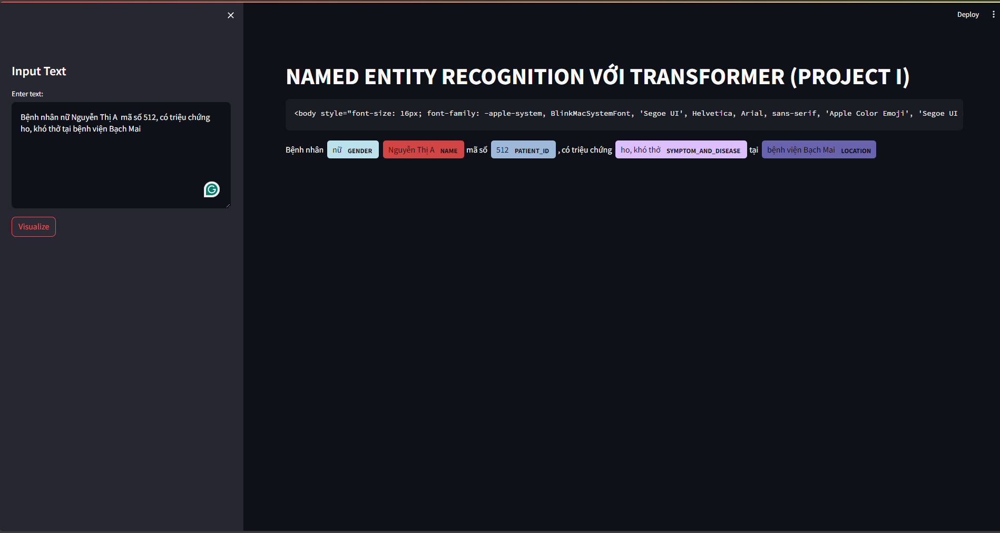

# Named Entity Recognition with Transformer (Project I)

This application performs Named Entity Recognition (NER) using a transformer-based model. Named Entity Recognition is a natural language processing task that aims to identify named entities (such as names of persons, organizations, locations, etc.) within a body of text. This project focuses on entities relate to covid-19 news.

## Installation

Before running the application, make sure you have the required packages installed. You can install them via pip:

```
pip install transformers
pip install streamlit
pip install spacy
pip install spacy-streamlit
pip install transformers
```

## Usage

1. Clone the repository:

```
git clone https://github.com/dat94-03/NER-with-Transformer-Project-I.git
```

2. Navigate to the project directory:

```
cd your-repository
```

3. Run the application:

```
streamlit run app.py
```
<h7>Result :</h7>
